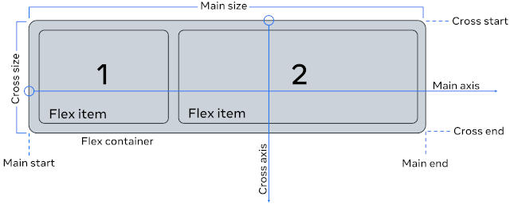

*flexbox* (`display: flex;`) is a [1-dimentional layout method](https://developer.mozilla.org/en-US/docs/Learn_web_development/Core/CSS_layout/Flexbox), does a better job of scaling over larger web pages and also provides more dynamic control of the containers. It can grow, shrink and align the items inside it.

For the items inside the flexbox container, the browser starts placing the items from the top-left corner moving along the *main axis* (in the horizontal direction by default). When the row is filled, the items continue to the next row.

Using `flex-direction` property we may instruct the browser to make the vertical direction the *main axis*

Image source: [CSS Tricks](https://css-tricks.com/snippets/css/a-guide-to-flexbox/#aa-basics-and-terminology)

* display: `flex` | `inline-flex`
* justify-content -  item alignment on *main axis* (`center` | `stretch` | `space-between` | `flex-end` | ?)
* align-items - alignment on *cross axis* (`flex-end` | `stretch` | ?)
* align-self - for unique flex items on *cross axis* (`center` |??)
* align-content - for packing flex lines and control over space
* flex-direction - `row` (default) or `column`
* `flex-flow: row wrap;`
* flex-wrap `wrap`
* gap
* `flex: 0 1 auto;` - shorthand notation for `flex-grow: 0; flex-shrink: 1; flex-basis: auto;`
* overflow: `hidden` - clip overflow content

More links
* https://css-tricks.com/snippets/css/a-guide-to-flexbox/
* https://learncssgrid.com/
* https://web.dev/learn/css/grid/
* https://www.educba.com/css-viewport/
* https://1stwebdesigner.com/fascinating-css-grid-layout-examples-and-tutorials/
* https://csslayout.io/ - defunct
