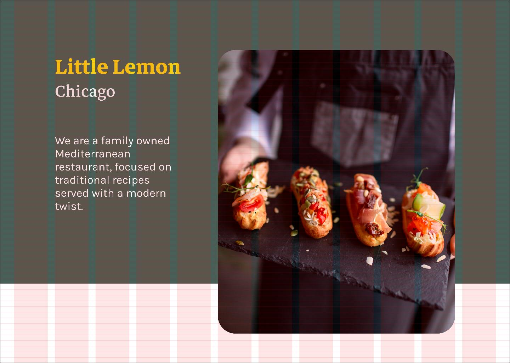

1. [Figma Grid exercise](https://www.coursera.org/learn/principles-of-ux-ui-design/supplement/K2uC7/exercise-design-text-hierarchy-and-grid)

* type for this exercise to a 16px baseline grid.
* desktop frame; 12-column grid; margin 40; gutter 20;
* “Rows" > Top: 16px (grid?)
* Parameters
  * typefaces: Karla, Markazi text,
  * one image
* Add the image and the background color
* Heading: *Little Lemon* MarkaziText (bold),  80px, color #F4CE14.
* Sub-heading: *Chicago* Markazitext (medium). 64px, color #EDEFEE.
* text: Karla (regular), size 32px; color `white`

Notice how the baseline grid creates consistent spacing with the type.

2. [Wireframe Figma exercise](https://www.coursera.org/learn/principles-of-ux-ui-design/supplement/sQIWS/exercise-create-wireframe-in-figma)

Step 1: Gather Requirements

Here you write down or sketch out what you require to go on to the page, such as the:
* Navigation bar
* Photo of the dish
* Delivery time
* Customize the dish
* Number of dishes to order
* Add to basket button

Step 2: Create a Frame and Grid
*  Open a new Figma file and create a frame.
*  Select the iPhone 13 Pro Max – 1.
*  Add a 4-column grid with a margin of 25.

Step 3: Construct a content block guide, using basic rectangles for each block.  
Add gray rectangles of various opacity (0-2): Nav. bar(1), Photo of Dish(2), Description(0),
Delivery(1), Customize(0), Amount(1), Add to ...(2).

Step 4: Move these guides out of the frame (to the right)

Step 5:
* Reduce the width of the guide rectangles.
* Keep the text as this provides a rough outline of all the content in the wireframe.
  You will use it as a reference while designing within the frame.

Step 6: Navigation bar (Header)
1. Add a "hamburger" menu icon. A way to navigate to the home screen is to use a "hamburger" menu to open a side menu as in the [video]().

2. Add a logo so users recognize what site they are on.

3. Add a shopping basket icon (for online delivery service). When the basket is tapped, it opens up a pop-up overlay that allows users to track and alter what they intend to purchase. It also adds an option to check out.

Note:
* Your navigation does not need to be detailed because it is usually secondary to the wireframe.
* Images are represented as a rectangle with a diagonal x through it.

Step 7 Placements
* Add a placement for an image of a dish (x-crossed rectangle)
* And add a placement (small circle in the left-top corner of above) for the "Back" button icon.

Step 8: Description
* Add a sub-heading "Greek Salad" and its price $12.99.
* Add body text to give a 3-line description: "The famous greek salad .."

Step 9: Delivery
*  Add an icon placement for a vehicle icon (bike).
*  Add a general time for delivery: "Delivaery 20 min"
*  Add a "Change" drop-down menu should a customer require another time for delivery.

Step 10: Customize
* "Add" text informs the user that they can add items to their dish.
* List three options, for each - price, "- +" placeholders

Step 11: Add to basket (add to order)
* a line with larger (centerd) "- 1 +"  displaying currently selected count of that Dish
* large nearly full-width button "Add for $12.99"
