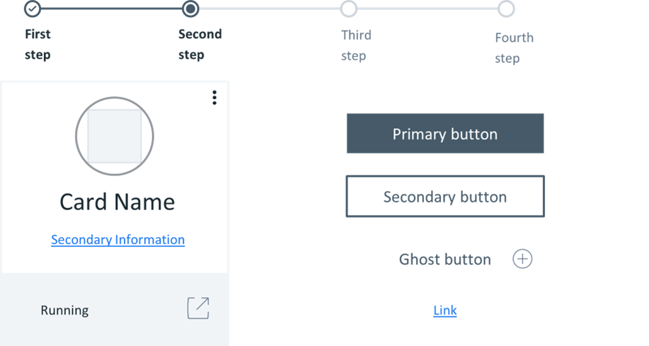

# Design systems

## Reusable Elements and Shared Values
Design systems are collections of reusable components, principles and guidelines that provide designers and developers with a common language for consistent product and web design.

A Design System is a set of deliverables that evolve alongside the product, tools and technological advances.
It contains both tangible and intangible elements like patterns, components, guidelines, and other designer and developer tools.

Additionally, they contain some abstract elements, such as brand values, shared ways of working, mindsets and shared beliefs.

1. Identity
  * Colors
  * Fonts
  * Graphics
  * Audio
  * Tone
2. Principles
  * Brand Values
  * Objectives
3. Best Practices
  * Accessibilities
  * Training
4. Components and Patterns
  * Design and Development
  * Functional Documentation
  * Technical Documentation

### Reusable elements
Reusable elements are advice on how to apply the elements together, which is the why and how. In the list above consider 1, 2, 3 all influencing 4.

#### What do design systems contain?

The primary goal of a design system is to make the work of design teams easier. So, the first question is not "What should I include in my Design System?" But rather, "Who will use it and how?" Once a goal has been defined and an idea of what's already in place in the company and questions like:

* What works and what doesn't?
* What is the teams' experience on this subject?
* What are the existing tools?

have been addressed and answered, it will be clearer where to start compiling the design system.

## Shared values

Aligning design teams around a standard set of goals is critical. It will help to create a vision and may ensure that everyone looks in the same direction. These objectives will change over time, which is natural. So, changes to the design system need to be widely communicated. In terms of values, they are great ideals that will guide choices in accordance with the brand objectives. Ensure that designs do not deviate from the fundamental values. Aside from these brand and product values, you should also define team values that help to unite each team member, which includes designers, developers and stakeholders, with a common mindset. These shared values may contain the following:

### Design principles

Design principles are guiding sentences that assist teams in achieving the goal of the product through design. While design principles are not the most common design system component, they should be considered. A set of meaningful design principles lays a better foundation and guides the team through the creation and ongoing implementation of a design system.

 An example of this is Google *Material design*[1] approach to design principles.
 It is minimalistic and focuses on what distinguishes Material Design as a universal design system. Their guiding principles are:

* Material is the metaphor.
* It is bold, graphic, and intentional.
* Motion provides meaning.

1. https://material.io/design/introduction#principles
2. [Examples of the ease of use and tools](https://m3.material.io/)
3. [Atlassian: an example of comprehensiveness](https://atlassian.design/)
4. [Polaris from Shopify: the incorporation of design into the workflows of designers and developers](https://polaris.shopify.com/)
5. [IBM did incredible work on the Design language](https://www.ibm.com/design/language/)

### Brand identity and language

The visible elements of a brand, such as color, design and logo, that identify and distinguish the brand in the minds of consumers are referred to as brand identity. These brand elements require some rules, which will serve as the system's grammar and unification, for example, do's and don'ts and "good examples" of product use, e.g.
* Assets: Stock photography should feature casual, simple restaurant images
* Products shots: Food photography should be warm and inviting
* Do's: Use photos featuring the environment or dishes shot in natural light
* Don'ts: use no studio shots or food photography that seems too stylized

This will ensure that the design teams use the "right combinations" of this language, which is what makes the brand so distinct and recognizable. Think of some popular brands and what makes them so distinct and recognizable.

### Components and patterns

The design system is built around components and patterns. Patterns are the building instructions that allow you to use these components logically and consistently across all products. A component, on the other hand, contains technical and functional documentation, and a pattern will provide recommendations on how to use it. All the previously mentioned elements will assist in developing them and help to deliver a consistent experience. The components are like blocks. As a designer, you can use these in layouts, and you can also use them directly in code. How they function and how a user interacts with them should be defined. Patterns are the building instructions that allow us to use these components logically and consistently across all products.

A component is specified with technical and functional documentation,
whereas a pattern will provide recommendations on how to use it.

## Concluding remarks
Design systems are composed of various components like patterns, styles, and guidelines that can assist in operationalizing and optimizing designs.

When implemented correctly, Desing System can educate team members, streamline work, and enable designers to tackle complex UX problems.

* [Design, manage, and deploy your design systems with Figma](https://www.figma.com/design-systems/)
* [What is a design system?](https://www.nngroup.com/articles/design-systems-101/)
* [links to Design System resources](https://www.uxpin.com/create-design-system-guide/recommended-resources)
* [Design Systems: A Practical Guide to Creating Design Languages for Digital Products](https://books.google.co.za/books/about/Design_Systems.html?id=UWhMswEACAAJ&redir_esc=y)
